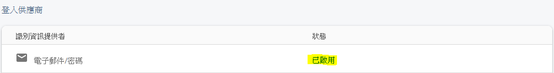
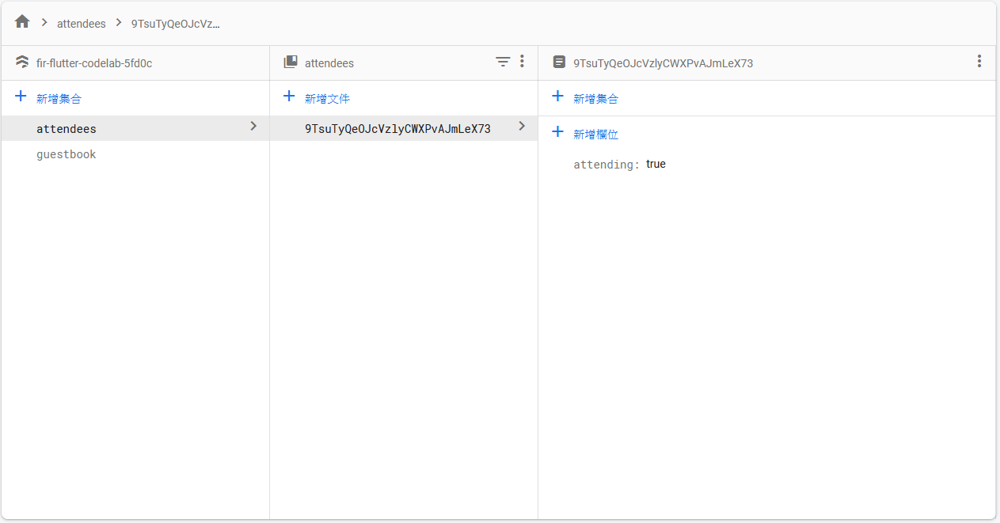

# flutter_firebase_codelab

## 使用

1. [iOS] 下載 `GoogleService-Info.plist`，開啟 Xcode，放入 `Runner/Runner`（注意是子 Runner） 資料夾下
2. [android] 下載 `google-services.json` 放入 `android/app` 資料夾下

## Firebase 設定

### Authentication



### Cloud Firestore

資料



規則

```
rules_version = '2';
service cloud.firestore {
  match /databases/{database}/documents {
    match /guestbook/{entry} {
      allow read: if request.auth.uid != null;
      allow write:
        if request.auth.uid == request.resource.data.userId
          && "name" in request.resource.data
          && "text" in request.resource.data
          && "timestamp" in request.resource.data;
    }
    match /attendees/{userId} {
      allow read: if true;
      allow write: if request.auth.uid == userId
          && "attending" in request.resource.data;
    }
  }
}
```

## Firebase Products

已完成

- [x] Firebase Authentication
- [x] Cloud Firestore
    - [x] Firebase Security Rules

未完成...

- [ ] ...

## 參考

- [CodeLab](https://firebase.google.com/codelabs/firebase-get-to-know-flutter#0)
    - firebase-get-to-know-flutter

## 更多

- Firebase site:  [firebase.google.com](https://firebase.google.com)
- Flutter site:  [flutter.dev](https://flutter.dev/)
- FlutterFire Firebase Flutter widgets:  [firebase.flutter.dev](https://firebase.flutter.dev/)
- [Firebase YouTube channel](https://www.youtube.com/user/Firebase/featured)
- [Flutter YouTube channel](https://www.youtube.com/FlutterDev)