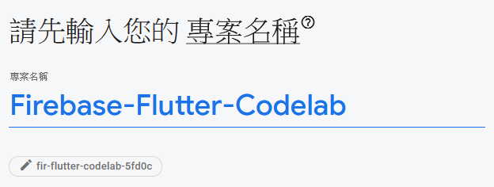

# 建立與設定 Firebase 專案

1. 新建專案
   
2. 命名
   

---

## **為Firebase身份驗證**啟用電子郵件登錄

開始使用

## 啟用Cloud Firestore

該Web應用程序使用[Cloud Firestore](https://firebase.google.com/docs/firestore/)來保存聊天消息並接收新的聊天消息。

