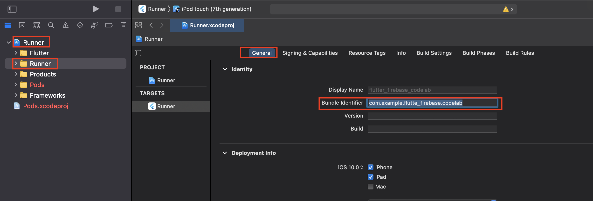

# 設定 IOS

1. 點擊

   

2. 提供 iOS 的 Bundle ID

   > **提示**：有關iOS捆綁包ID的更多信息，請閱讀[什麼是應用程序ID和捆綁](https://cocoacasts.com/what-are-app-ids-and-bundle-identifiers/)包標識符。

3. 在終端機中，在 flutter 專案根目錄

4. 執行指令 `open ios/Runner.xcworkspace` 打開Xcode。

   > **提示**：閱讀有關[信息屬性列表文件](https://developer.apple.com/library/content/documentation/General/Reference/InfoPlistKeyReference/Articles/AboutInformationPropertyListFiles.html)以獲取有關Xcode屬性列表的更多信息。

5. 在Xcode中，單擊左窗格中的頂級**Runner** ，然後在Targets下選擇**Runner** ，以在右窗格中顯示**General**選項卡，如圖所示。複製**捆綁包標識符**值。
   

6. 返回Firebase對話框，將復制的**Bundle Identifier**粘貼到**iOS bundle ID**字段中，然後單擊**Register App** 。

   > **注意**： **Bundle Identifier**的實際值取決於您為Flutter應用命名的名稱。

7. 在Firebase中繼續，按照說明下載配置文件**`GoogleService-Info.plist`** 。

8. 返回到Xcode。請注意， **Runner**具有一個也稱為**Runner**的子文件夾（如上圖所示）。

9. 將`GoogleService-Info.plist`文件（剛剛下載）拖到該**Runner**子文件夾中。

10. 在Xcode中出現的對話框中，點擊**完成**。

11. 由於現在不需要Xcode，因此請隨時關閉Xcode。

12. 返回Firebase控制台。在設置步驟中，單擊“**下一步”** ，跳過其餘步驟，然後返回Firebase控制台的主頁。

