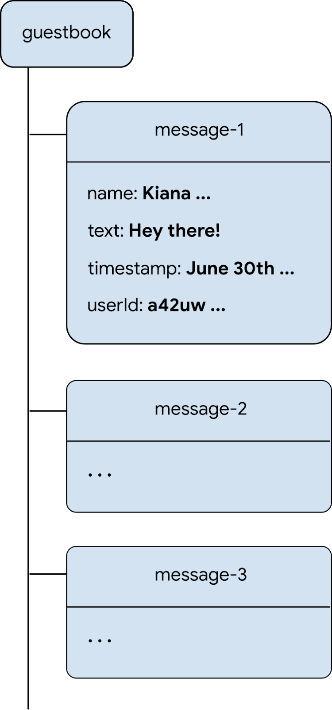

# Firestore

[Write messages to Cloud Firestore](https://firebase.google.com/codelabs/firebase-get-to-know-flutter#5)

## Data Model

> **Tip**: To learn more about the Cloud Firestore data model, read about documents and collections in  [the Cloud Firestore documentation](https://firebase.google.com/docs/firestore/data-model). You can also watch a  [great series of videos](https://www.youtube.com/playlist?list=PLl-K7zZEsYLluG5MCVEzXAQ7ACZBCuZgZ) that describe the Cloud Firestore NoSQL data model, queries, and other cool things that you can do with Cloud Firestore.

