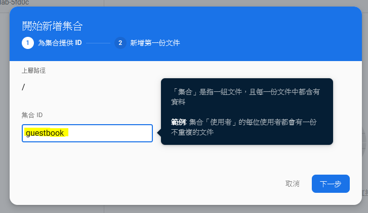
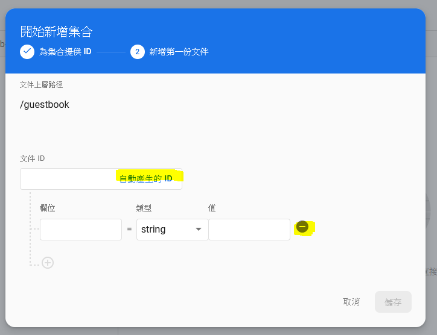
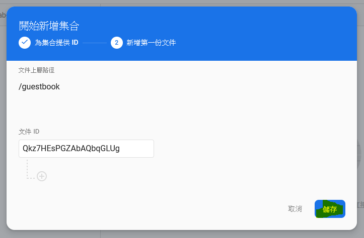
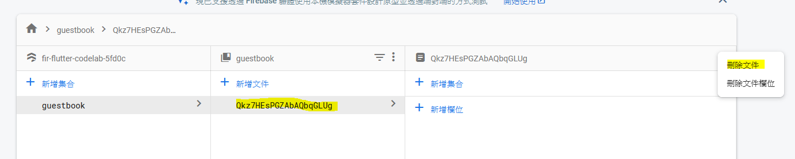

# Firestore Collection

A user clicking the **SEND** button will trigger the code snippet below. It adds the contents of the message input field to the `guestbook` collection of the database. Specifically, the `addMessageToGuestBook` method adds the message content to a new document (with an automatically generated ID) to the `guestbook` collection.

Note that `FirebaseAuth.instance.currentUser.uid` is a reference to the auto-generated unique ID that Firebase Authentication gives for all logged-in users.

Make another change to the `lib/main.dart` file. Add the `addMessageToGuestBook` method. You will wire the user interface and this capability together in the next step.

