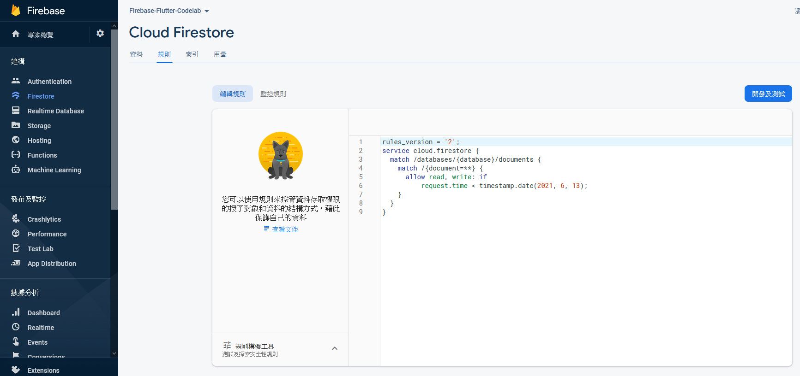

# Basic Security Rules

Security Rules allow you to control access to documents and collections  in your database. The flexible rules syntax allows you to create rules  that match anything from all writes to the entire database to operations on a specific document.

You can write security rules for Cloud Firestore in the Firebase console:

1. In the Firebase console's **Develop** section, click **Database**, and then select the **Rules** tab (or  [click here](https://console.firebase.google.com/project/_/database/firestore/rules) to go directly to the **Rules** tab).
2. You should see the following default security rules, along with a warning about the rules being public.




> Check out the  [Firebase Security Rules documentation](https://firebase.google.com/docs/rules) or this  [YouTube playlist](https://www.youtube.com/watch?v=QEuu9X9L-MU&list=PLl-K7zZEsYLn8h1NyU_OV6dX8mBhH2s_L) to learn more about security rules.


## Identify collections

First, identify the collections to which the app writes data.

In `match /databases/{database}/documents`, identify the collection that you want to secure:

```
rules_version = '2';
service cloud.firestore {
  match /databases/{database}/documents {
    match /guestbook/{entry} {
     // You'll add rules here in the next step.
  }
}
```

## **Add security rules**

Because you used the Authentication UID as a field in each guestbook  document, you can get the Authentication UID and verify that anyone  attempting to write to the document has a matching Authentication UID.

Add the read and write rules to your rule set as shown below:

```
rules_version = '2';
service cloud.firestore {
  match /databases/{database}/documents {
    match /guestbook/{entry} {
      allow read: if request.auth.uid != null;
      allow write:
        if request.auth.uid == request.resource.data.userId;
    }
  }
}
```

Now, for the guestbook, only signed-in users can read messages (any message!), but only a message's author can edit a message.

## **Add validation rules**

Add data validation to make sure that all of the expected fields are present in the document:

```
rules_version = '2';
service cloud.firestore {
  match /databases/{database}/documents {
    match /guestbook/{entry} {
      allow read: if request.auth.uid != null;
      allow write:
      if request.auth.uid == request.resource.data.userId
          && "name" in request.resource.data
          && "text" in request.resource.data
          && "timestamp" in request.resource.data;
    }
  }
}
```


